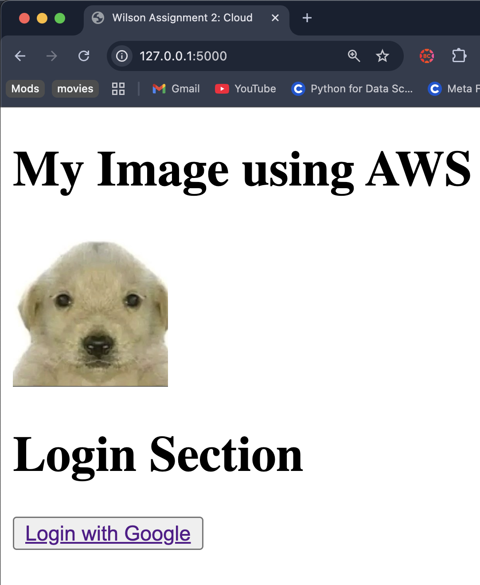
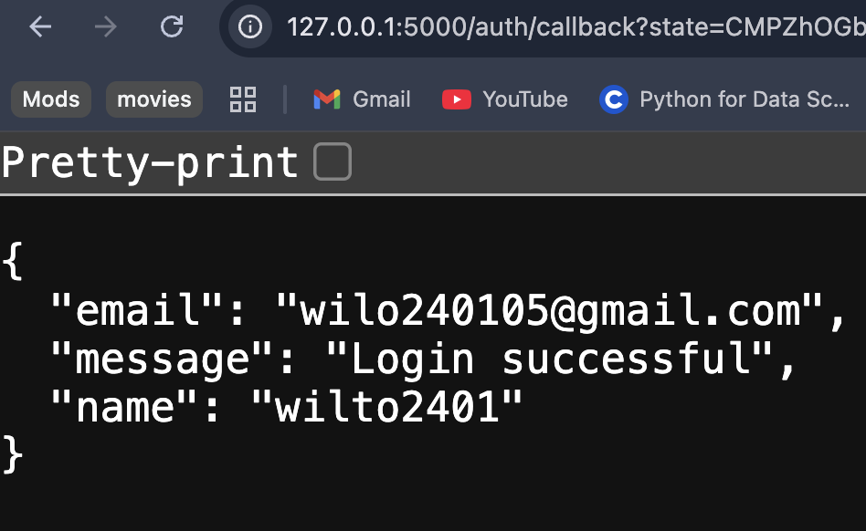
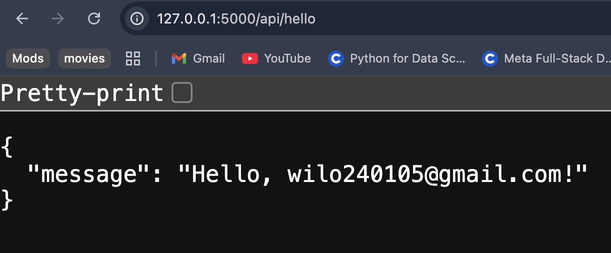
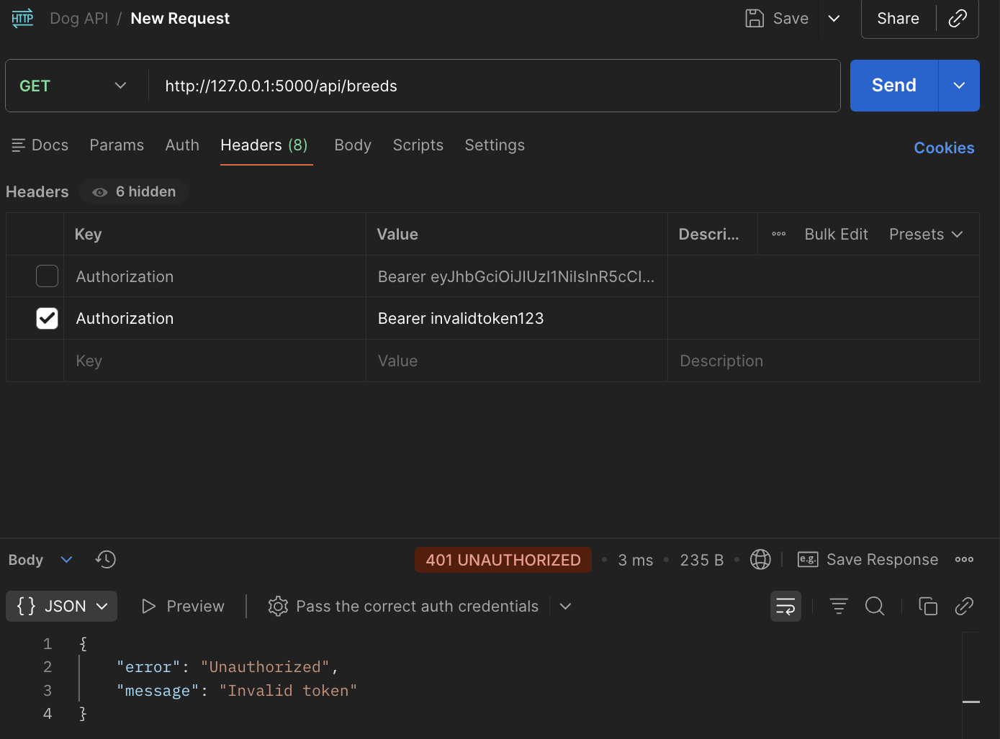
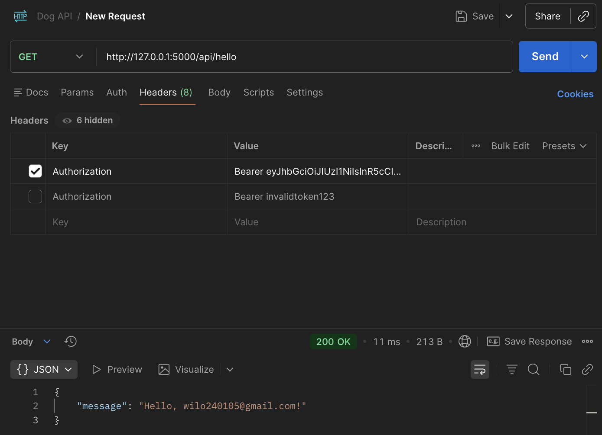
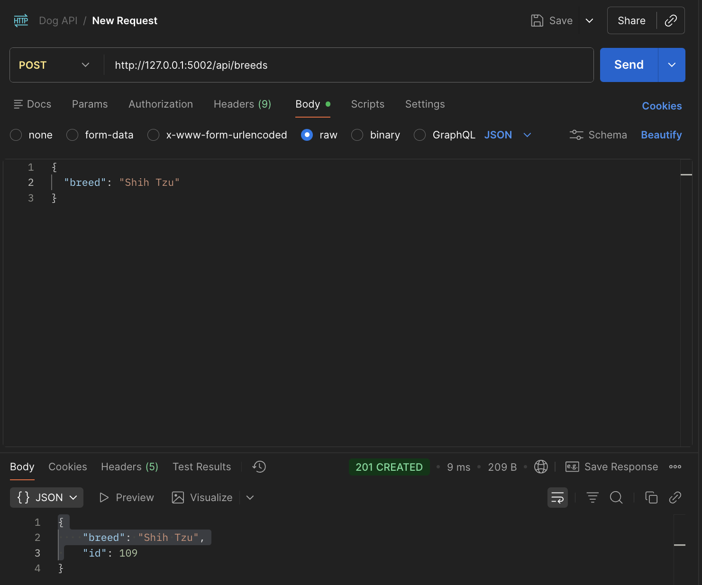
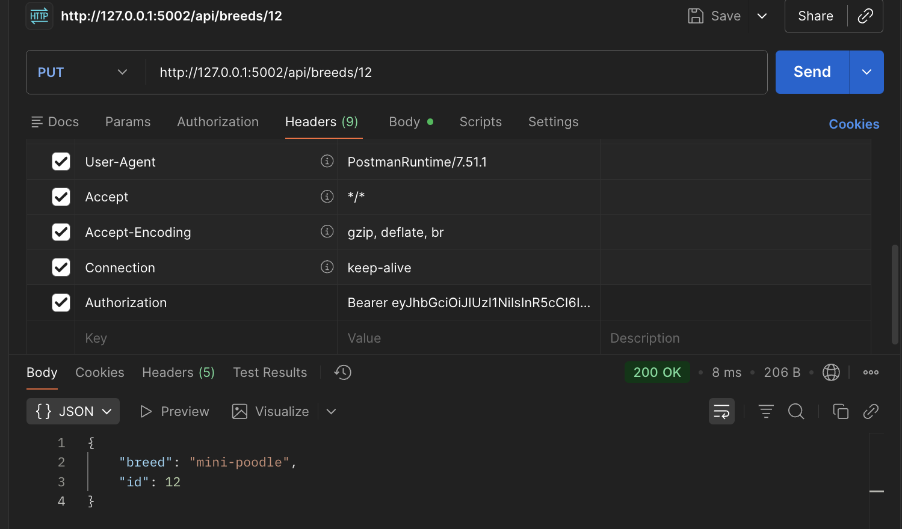

# Wilson Quilli

## SWENG 861: Software Construction

## Social Media App for College Students
A social media app used only by college students, their accounts will expire once they graduate college and can only create accounts, while in college. This allows for stduents to document and share their college experience, showcasing everything they have learned and done and any new people they have met. 

## Authentication Strategy
I implemented Option A: Social Login (B2C) using Google as the Identity Provider (IdP). This approach follows industry practices by integrating with a trusted external identity provider rather than building authentication from scratch. A lot of people all around the world also use Google, making it easier to sign in with Google. It is well suited for consumer-style, student-facing applications like this social media platform. Using OAuth2 and OpenID Connect improves security while simplifying the login experience for users.

### Authentication Flow Description
The user clicks “Log in with Google” and is redirected to Google’s OAuth authorization endpoint. After authenticating, Google redirects the user back to the application with an authorization code. The backend exchanges this code for tokens, validates the OpenID Connect ID token, and extracts the user’s identity information, such as email and name.

### Authentication Flow Steps
- Client  
- Login button  
- Google Identity Provider (IdP)  
- OAuth callback  
- Backend token exchange and validation  
- ID token received  
- Authenticated user identity available to protected APIs

## Protected Endpoint Description

The application secures the GET /api/hello endpoint using a reusable authentication middleware called require_auth. This middleware runs before the endpoint handler and verifies that the user is authenticated by checking for a valid session established during the OAuth login flow. If authentication fails or no session is present, the middleware immediately returns a 401 Unauthorized JSON response without executing the endpoint logic. When authentication succeeds, the middleware attaches the authenticated user’s identity to the request context, allowing the endpoint handler to safely generate a personalized greeting using the user’s email while avoiding exposure of sensitive data.

- **Unauthenticated requests** receive a 401 Unauthorized response with a JSON error message.
- **Authenticated requests** receive a personalized greeting using the user’s email extracted from the session.

### Security Practices Applied
- Avoided Broken Object Level Authorization (BOLA):  
  The endpoint does not accept user identifiers from the client and relies solely on the authenticated session context.
- Avoided Excessive Data Exposure: 
  Only a simple greeting message is returned; no sensitive user data or tokens are exposed.
- Avoided Security Misconfiguration:
  Error responses do not expose stack traces or internal server details.

## Testing & Verification

### Test 1: Unauthenticated Request
- Endpoint: GET /api/hello
- Condition: User not logged in
- Result: 401 Unauthorized
- Response includes a JSON error message indicating authentication is required.

### Test 2: Authenticated Request
- Endpoint: GET /api/hello
- Condition: User logged in via Google OAuth
- Result: 200 OK
- Response returns a personalized greeting using the authenticated user’s email.

Manual testing was performed using a browser, Google Chrome, to demonstrate the full OAuth login flow and protected API access.

## Bonus Features

### Enhanced Security: Rate Limiting & Logging
Basic security hardening was implemented to protect authentication and API endpoints.

- Rate Limiting:
  Login and protected API endpoints are rate-limited to prevent brute-force attacks and abuse. Excessive requests from the same IP within a short time window are rejected with a 429 Too Many Requests response.

- Suspicious Activity Logging: 
  Unauthorized access attempts and rate-limit violations are logged server-side, allowing detection of abnormal behavior such as repeated failed access attempts from the same IP address.

## Short Summary
I used Option A: Social Login (B2C) with Google as the Identity Provider (IdP). The login flow works from start to finish: when a user clicks “Log in with Google,” they are sent to Google to sign in and give permission to their Google Account. Google then sends them back to my backend at /auth/callback, which exchanges the code for an ID token, checks that it is valid, and either adds a new user or updates an existing user in the database. After logging in, the user gets a session that lets them access the protected endpoint GET /api/hello. I checked all the authentication code for security problems. Tokens are validated using Google’s library, no tokens are logged, and secrets like Google_Client_Secret and Flask_Secret_Key are kept safe in environment variables in an .env file. One problem I ran into was a missing column for last_login_at in the database, which I fixed by updating the model and running db.create_all(). I also added bonus features: simple rate limiting on login and protected endpoints, and logging of suspicious activity, like unauthorized requests or too many requests from the same IP. Overall, the assignment was about security and ensuring my webpage isn't bombarded by attacks.

## Consuming 3rd Party API and Data Validation
To consume a 3rd-party API, I integrated the Dog CEO API (`https://dog.ceo/api/breeds/list/all`) into my application. This API provides a JSON list of dog breeds and their sub-breeds.  

### API Consumption Flow

1. Admin users can trigger a fetch from the Dog CEO API via a protected endpoint:  
POST /api/breeds/fetch_external

2. The backend requests data from the Dog CEO API using Python’s requests library.

3. The response is validated:
   - Ensures the JSON contains a message object.
   - Confirms each breed is a non-empty string.
   - Ignores invalid or empty sub-breeds.

### Data Validation
- The API response is checked for the correct structure before inserting into the database.
- Breeds and sub-breeds are stripped of leading/trailing spaces.
- Duplicate entries are ignored using INSERT OR IGNORE in SQLite.
- Invalid or empty data is skipped to prevent corrupt or malformed entries.

### Database Persistence
- Validated breeds are stored in a local SQLite database (dog_api.db).
- Schema includes:
  - breeds table: id, breed
  - subbreeds table: id, breed_id (foreign key), subbreed
- Sub-breeds are linked to their parent breed through a breed_id.
- The database is initialized at startup, and cached endpoints are cleared after updates.

## Sample Tests of Backend Screenshots (Taken in Postman)
1. Unauthorized URL

2. Authorized URL

3. Fake URL

4. Breeds Display

5. GET Dog Breeds

6. POST Shih Tzu

7. PUT Mini Poodle

8. DELETE Mini Poodle

### How to Run
Frontend - npm start within frontend folder
Backend - python3 app.py within backend folder